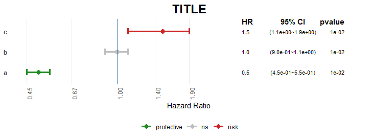
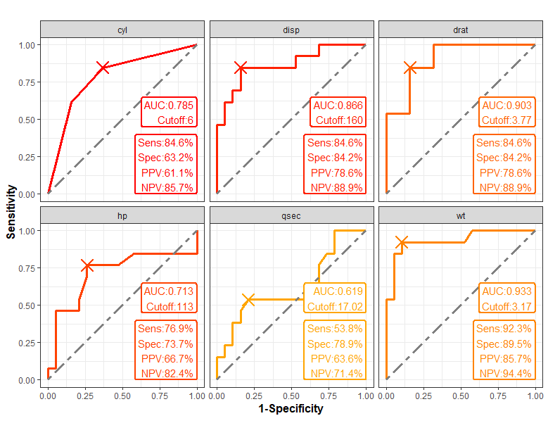
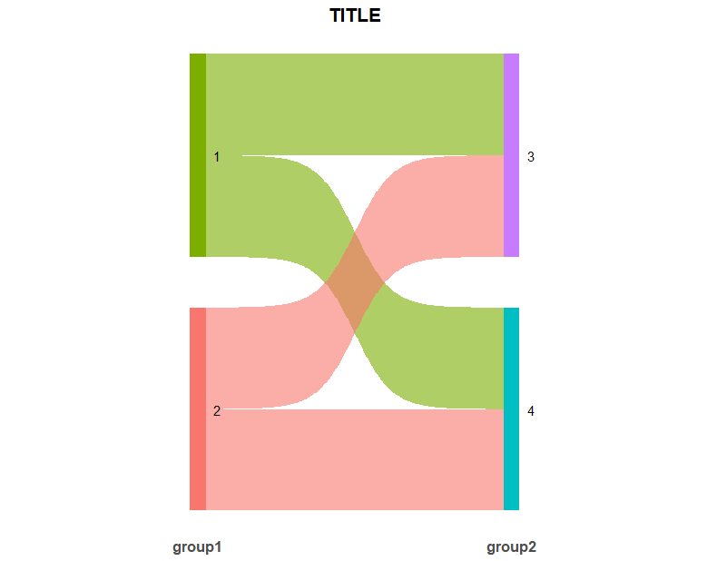
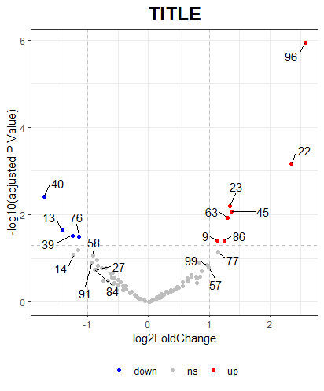

# ggonekey

<!-- badges: start -->

<!-- badges: end -->

To draw ggplot2 plots with one single function(forest plots, multiple roc plots, sankey plots, volcano plots).

## Installation

You can install the development version of ggonekey like so:

```r
devtools::install_github("NiannianSoHungry/ggonekey")
```

## Example

### forestonekey()

```r
library(ggonekey)
unicox <- data.frame(
  id = c("a", "b", "c"),
  hr = c(0.5, 1, 1.5),
  low.95 = c(0.45, 0.9, 1.1),
  high.95 = c(0.55, 1.1, 1.9),
  p.value = c(0.01, 0.01, 0.01)
)

forestonekey(
  data = unicox,
  features = "id",
  l95 = "low.95",
  h95 = "high.95",
  HR = "hr",
  pvalue = "p.value",
  title = "TITLE"
)
```



### roconekey()

```r
library(ggonekey)
roconekey(data = mtcars, start = 2, end = 7, truth = "am", nrow = 2)
```



### sankeyonekey()

```r
library(ggonekey)
data <- data.frame(
  group1 = c(1, 1, 2, 2),
  group2 = c(3, 4, 3, 4)
)

data <- ggsankey::make_long(data, group1, group2)
data$node <- factor(data$node, levels = rev(unique(data$node)))
data$next_node <- factor(data$next_node, levels = rev(unique(data$next_node)))

sankeyonekey(make_long = data, title = "TITLE")
```



### volcanoonekey()

```r
library(ggonekey)
set.seed(123)
cnts <- matrix(rnbinom(n = 1000, mu = 100, size = 1 / 0.5), ncol = 10)
cond <- factor(rep(1:2, each = 5))

dds <- DESeq2::DESeqDataSetFromMatrix(cnts, DataFrame(cond), ~cond)

dds <- DESeq2::DESeq(dds)
res <- DESeq2::results(dds)

DEG <- as.data.frame(res)
DEG$gene <- rownames(DEG)

volcanoonekey(
  data = DEG,
  gene = "gene",
  logfc = "log2FoldChange",
  pvalue = "pvalue",
  title = "TITLE",
  labeled = TRUE
)
```


